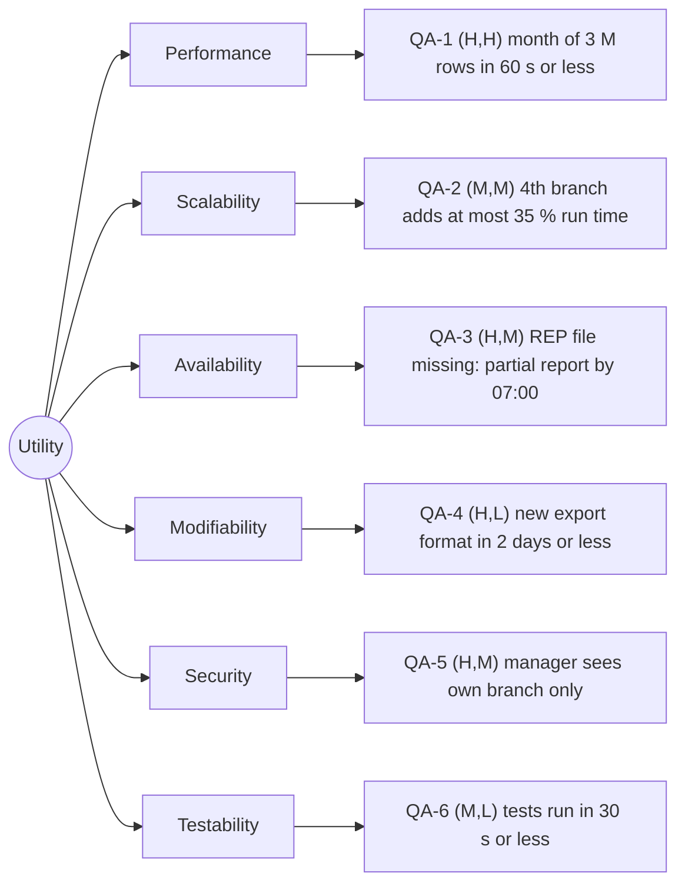

# Quality-attribute scenarios: Angkor Mart monthly sales report

## Stakeholders

- Head-office analyst: views and exports the chain and branch reports; needs correct numbers on the morning of day 2.
- Branch manager (PNH, REP, BTB): views only the report of their own branch.
- Finance director: receives an e-mail when the report is ready; needs to trust that it is complete.
- Operations person: runs and monitors the nightly and monthly jobs, handles late or broken branch files.
- Development team (us): adds export formats and branches, and must test every change quickly.

## Scenarios

| ID   | Attribute     | Source                                                         | Stimulus                                                              | Artifact                           | Environment                                             | Response                                                                                                                                                                              | Response measure                                                                                                                                                                                                    | Rank  |
| ---- | ------------- | -------------------------------------------------------------- | --------------------------------------------------------------------- | ---------------------------------- | ------------------------------------------------------- | ------------------------------------------------------------------------------------------------------------------------------------------------------------------------------------- | ------------------------------------------------------------------------------------------------------------------------------------------------------------------------------------------------------------------- | ----- |
| QA-1 | Performance   | Scheduler, 06:00 on day 2 of M+1                               | Starts the report for a month of about 3 M rows (90 daily files)      | Report engine                      | Normal operation, 8-core server, SSD, all files present | Report files written, "ready" event published                                                                                                                                         | <= 60 s wall-clock from start to "ready" event, median of 5 runs after 2 warm-up runs                                                                                                                               | (H,H) |
| QA-2 | Scalability   | Head-office management                                         | The chain opens a 4th branch (+33 000 rows per day, +33 % data)       | Report system (ingest and engine)  | Normal operation, same 8-core server                    | New branch appears in all reports by configuration only                                                                                                                               | Run time grows <= 35 % (<= 81 s, median of 5 runs after 2 warm-up runs); <= 1 configuration file changed, 0 Java lines changed                                                                                      | (M,M) |
| QA-3 | Availability  | REP branch internet link                                       | Link fails; the REP file of the last day is missing at 06:00 on day 2 | Ingest job and report batch        | Normal operation, PNH and BTB files complete            | Partial report for PNH and BTB published and marked "incomplete: REP missing"; operations alerted; when the REP file arrives, the full report is rebuilt and replaces the partial one | Partial report ready by 07:00 (<= 60 min after the scheduled start) in 100 % of 10 simulated runs; full report <= 15 min after the late file arrives; 0 duplicated rows (row count equals the sum of all file rows) | (H,M) |
| QA-4 | Modifiability | Head-office analyst (requests the change), developer (does it) | Asks for a new export format (for example JSON)                       | render package                     | Development, before a release                           | New renderer added and selected by file extension; other packages untouched                                                                                                           | <= 2 person-days; <= 1 new class and <= 3 changed lines in existing files; 0 changed lines in model, ingest, engine (checked with `git diff --stat`)                                                                | (H,L) |
| QA-5 | Security      | Authenticated branch manager of REP                            | Requests the PNH report (changes the branch id in the URL)            | Web report page and access control | Normal operation over HTTPS                             | Request rejected with HTTP 403; attempt written to the audit log                                                                                                                      | 100 % of 30 cross-branch requests in an automated test denied (3 managers x 2 other branches x 5 report URLs); 0 bytes of other-branch data in the response body; log entry within 1 s                              | (H,M) |
| QA-6 | Testability   | Developer                                                      | Runs the engine and parser tests after a change                       | Engine, parser, renderers          | Developer laptop, no network, no real data files        | Tests run on small fixtures and temporary files and give the same result every run                                                                                                    | Full `mvn test` <= 30 s wall-clock, median of 5 runs; 0 tests needing the network or `data/`; <= 5 % of runs with a flaky result over 20 runs                                                                       | (M,L) |

## Rank justifications

- QA-1 (H,H): the report is due on the morning of day 2 and 3 M rows with BigDecimal arithmetic must be parsed and aggregated, so the data-handling design decides whether 60 s is reachable.
- QA-2 (M,M): a 4th branch is plausible but not planned, and it is only a moderate problem if the branch list and codes are configuration instead of hard-coded.
- QA-3 (H,M): branch links "fail now and then" and a missing file must not block the whole chain report, which needs a clear partial-report and late-merge policy.
- QA-4 (H,L): head office explicitly wants PDF, Excel and web formats, and the Strategy pattern makes each new format cheap.
- QA-5 (H,M): branch managers must not see other branches' figures, so access control must be enforced on the server for every report and cannot be left to the UI.
- QA-6 (M,L): fast, deterministic tests matter for the team's pace, and plain functions on small fixtures make this easy.

## Assumptions

- A1: the report server has 8 cores and an SSD (to confirm with the client).
- A2: one month is 3 branches x 30 days x 33 000 rows = about 3 M rows (2.97 M), 90 files.
- A3: the report must be ready by 07:00 on day 2; the job starts at 06:00 (to confirm with the client).
- A4: for QA-3 we wait until 06:00 for the last files; no file earlier in the month is missing.
- A5: a 4th branch has the same volume as the existing ones (33 000 rows per day).
- A6: branch managers log in with an account bound to exactly one branch; analysts see all branches.
- A7: access is over HTTPS only, and the audit log is a file or table on the server.
- A8: the test machine for QA-6 is an ordinary laptop (4 cores, SSD) with the JDK 25 and Maven 3.9.

## Utility tree

## Architectural drivers

QA-1, QA-3, QA-5
